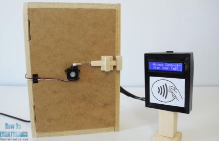

## Smart Attendance system (RFID-Based Attendance System with Automated Absence Tracking)
In this project, we have created a complete system for smart attendance along with a smart door. 

The system works as follows: 
A package containing an RFID module, a buzzer, and a servo motor is placed on the classroom door.
Using the RFID module and a database containing information about the timing of various classes and the students attending each class during the week, the system only allows students to enter the room during their scheduled class times.

This system can also provide a list of participants in each class to the course instructor. The way it works is as follows: Any student who wants to enter the class must place their RFID tag in front of the package. If the student is granted access to the class, the door automatically opens using the servo motor, and their name is added to the list of attendees. Additionally, if a student presents their tag to the system after 15 minutes from the start of the class, the door will open, but their name will be added to the list of absentees for that session.
the result is something like the picture below.

